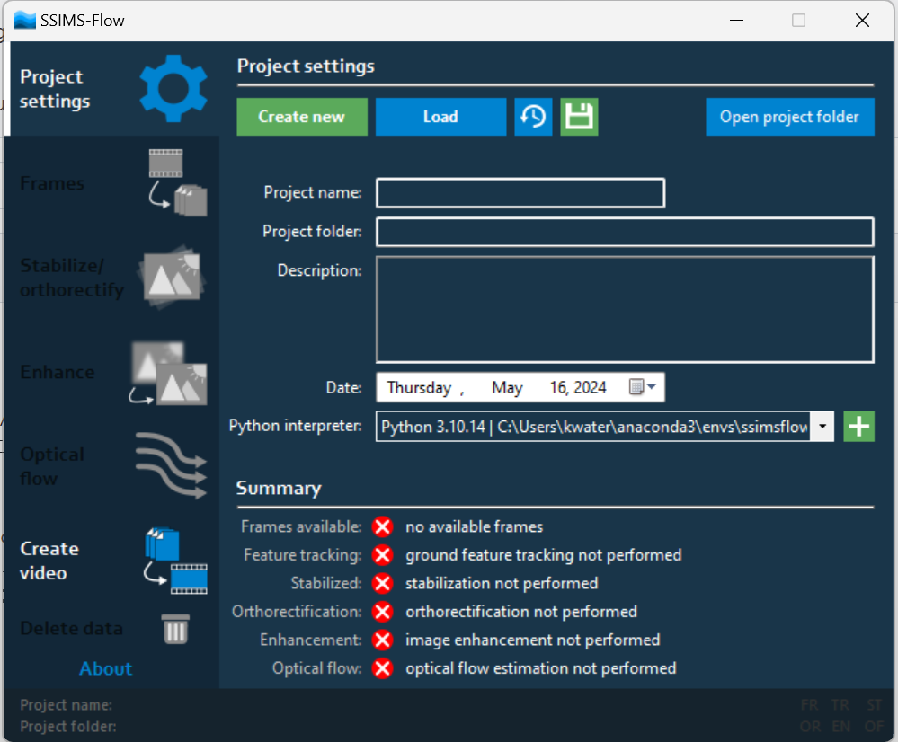
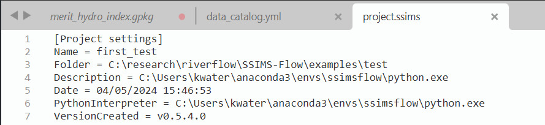

# group-2
## Measurement of waterlevel or riverflow

**1. SSIMS-Flow의 이용: https://github.com/ljubicicrobert/SSIMS-Flow**
 - 현재 README 파일의 절차에 따라서 프로그램을 설치하면 잘 작동합니다.
   
  a. Anaconda 설치

  b. 새로운 conda environment 설치
  
  c. conda environment내에 requirements.txt를 이용하여 python library 설치하기
  
  d. .NET Framework 4.5.1+ 설치
  
  e. SSIMS-Flow github에서 다운 받아서 "SSIMS-Flw.exe" 더블클릭하여 프로그램 실행하기
  
  f. python interpreter에 conda에서 설치한 새로운 conda environment내의 python.exe를 지정하기 or examples 폴더내의 project.ssims 파일에서 직접 conda에서 설치한 새로운 conda environment 경로지정하기
  

**2. Fudaa-LSPIV**
 - Thanks for your feedback on the paper and the software !
   First, you can try downloading the latest version of Fudaa-LSPIV : https://nextcloud.inrae.fr/s/Z95gg42b9jMrDA4
   This version comes with an embedded java distribution which solves many java issues. The problem you described could be due to such java issue.
   Please try again with the version 1.10.1, I think it may work.
   Also, the “R_batch_Fudaa-LSPIV” is a folder with R scripts written to call Fudaa-LSPIV executables. This was developed for those who want to have an “automatic” LSPIV computation, without using the Fudaa- LSPIV interface (GUI).
  If you want to experiment LSPIV on a typical field case, I recommend using rather the videos “Video_GDH_X.zip”. These 8 videos are the one presented in the paper by the way.
  Do you want to use Fudaa-LSPIV for your research ? I ask because if you need to post-process the Fudaa-LSPIV results I can share a Python library made for that ! Don’t hesitate to ask 😉
  If you need any support, you can ask me or the fudaa-lspiv team at :  fudaa-lspiv.dev@inrae.fr
